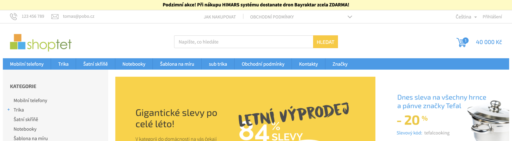

# Jak psát efektivně doplňky, úpravy nebo vzhled pro Shoptet

V tomto návodu si ukážeme jednoduchý a efektivní postup, jak psát elegantně doplňky, úpravy nebo
šablony (vzhled) pro Shoptet bez nutnosti nahrávat kód ve vývojové fázi na FTP (či administrace e-shopu) s 
využitím bundlovacího nástroje [Parcel v2](https://www.vzhurudolu.cz/prirucka/parcel-js) s hot reloadem a
proxy serveru [ngrok](https://ngrok.com/). 

# Benefity - aneb co mi to přinese

- Efektivní psaní CSS a JS → změny v kódu na mém PC se okamžitě propíšou na e-shop
- Podpora LESS, SASS, ES6 a dalších jazyků → vše na jednom místě
- Automatická minifikace kódu → nižší výsledná velikost → rychlejší načtení e-shopu
- Podpora sourcemap → pro rychlejší hledání chyb
- Kontrola syntaxe kódu → méně chyb při vývoji


## Požadavky

Před tím, než začneme s těmito nástroji pracovat, je nutné mít na svém stroji nainstalovaé nástroje: 

1. Verzovací systém [git](https://git-scm.com/)
2. [nodejs](https://nodejs.org/en/) (min. >=14)
3. [npm](https://www.npmjs.com/) (min. >=6) nebo [Yarn](https://yarnpkg.com/)

## Stažení repozitáře

V prvním kroku si stáhneme tento repozitář pomocí příkazu:
```
git clone git@github.com:pobo-builder/shoptet-boilerplate-addon.git
```

Následně nainstalujeme závislosti: 
```
npm install
```
používáme-li Yarn, spustíme:
```
yarn install
```

# Adresářová struktura - aneb co je co

Po instalaci závislostí v adresáři uvidíme následující strukturu:

``` 
├── README.md
├── dist
├── node_modules
├── package-lock.json
├── package.json
└── src
    ├── asset.js
    └── asset.scss
```

Nás převážně zajímá: 

1. Adresář `dist/*` obsahuje JS a CSS, které se kompilují z adresáře `src/*`
2. V adresáři `src/*` se nacházejí zdrojové JS a SCSS soubory, které používáme při vývoji 
3. V Souboru `package.json`, v sekci `scripts` se nacházejí následující příkazy, které můžeme použít:
   1. `watch` (spouštíme příkazem `npm run watch`) sleduje veškeré soubory v adresáři `src/*` a při jejich změně k dojde ke kompilaci do `dist/*`
   2. `build` (příkaz `npm run build`) provede kompilaci souborů `src/*` do `dist/*`, odstraní sourcemaps a zminifikuje kód
   3. `proxy` (`npm run proxy`) vytvoří tunel (proxy) z `localhost:8088` na veřejnou URL (vysvětleno dále) 


## Píšeme první úpravu

Nyní začneme psát první úpravu našeho e-shopu. Spustíme příkaz `npm run watch` a terminál nám vrátí následující výsledek:


Nyní **Parcel** sleduje soubory JS a SCSS v adresáři `src/*` a při jejich změně je zkompiluje do adresáře `dist/*`. Dále
**Parcel** vytvořil tzv. *dev server* na lokálním PC, který poslouchá na portu **8088** (lze otestovat otevřením [http://localhost:8088](http://localhost:8088)).

Nyní si v nové záložce terminálu spustíme příkaz `npm run proxy`, terminál vrátí následující výsledek:


Vidíme, že **ngrok** vystavil lokální server veřejně na URL `http://3915-77-78-81-137.ngrok.io/`, **číslo před doménou
bude při dalším spuštění vždy jiné** (generuje se při opětovném zavolání proxy).

Nyní si otevřeme URL:

- `http://3915-77-78-81-137.ngrok.io/asset.js`
- `http://3915-77-78-81-137.ngrok.io/asset.css`

Obsah těchto souborů je totožný¹ se soubory:

- `src/asset.js`
- `src/asset.css`

¹ U JavaScript ve vývojovém režimu **Parcel** vkládá např. service worker, debugger atd., nicméně vždy vykonává náš kód.

URL těchto souborů nyní vložíme do Shoptet administrace:

```html
<script async src="https://3915-77-78-81-137.ngrok.io/asset.css"></script>
<link rel="stylesheet" href="https://3915-77-78-81-137.ngrok.io/asset.css" media="print" onload="this.media='all'">
```


# Přidání informační lišty nad hlavičku 

Nyní si zkusíme nad hlavičku e-shopu přidat informační lištu např. o podzimní akci. Klasická hlavička ve 
výchozím stavu vypadá přibližně takto:


Do souboru `src/asset.js` vložíme následující kód:

```javascript
const elem = document.createElement('div');

elem.innerHTML = `
  <div class="pobo-text-header">
    Podzimní akce! Při nákupu HIMARS systému dostanate dron Bayraktar zcela ZDARMA!
  </div>`;

document.body.appendChild(elem);
```

Lištu si nyní nastylujeme - vložíme do souboru `src/asset.css` následující kód:

```css
.pobo-text-header {
  position: fixed;
  top: 0;
  width: 100%;
  height: 30px;
  line-height: 30px;
  background: #fffabf;
  color: black;
  font-weight: 600;
  text-align: center;
}

body {
  margin-top: 30px;
}
```
Po uložení kódu vidíme nad hlavičkou v našem e-shopu novou lištu:



A je to. Nyní můžeme pokračovat dále v úpravách v pdostatě jakékoliv části, kód se vždy po uložení „promítne“ na e-shop,
což je velký benefit. 

Pro naše účely provedeme poslední akci - JavaScript a SCSS zkompilujeme do produkčního stavu. 

Zastavíme oba příkazy `npm run watch` i `npm run proxy` (CMD+C na MacOS / CTRL+C na Win / linux) a smažeme načítání
JavaScript a CSS z administrace Shoptetu. 

Poté spustíme příkaz `npm run build`:


**Parcel** zkompiloval JavaScript a SCSS, provedl minifikaci a odstranil source map:

Soubor: `dist/asset.js`
```javascript
const n=document.createElement("div");n.innerHTML='\n\t<div class="pobo-text-header">\n\t\tPodzimní akce! Při nákupu HIMARS systému dostanate dron Bayraktar zcela ZDARMA!\n  \n\t</div>\n',document.body.appendChild(n);
```

Soubor: `dist/asset.scss`
```css
.pobo-text-header{width:100%;height:30px;color:#000;text-align:center;background:#fffabf;font-weight:600;line-height:30px;position:fixed;top:0}body{margin-top:30px}
```

Tyto soubory poté soubory posíláme klientovy k uložení do svého e-shopu, popř. ukládáme na CDN Shoptetu, nikoliv na své FTP (riziko DDOS útoku a nedostupnost).

